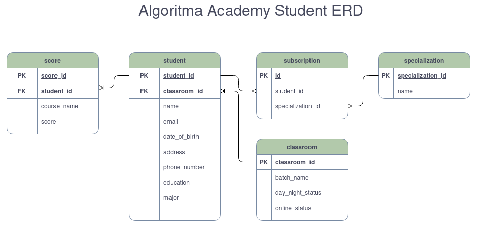

# Algoritma Academy API

This project build Rest API for Algoritma Academy using python django framework.
here the ERD 

TODO:
[X] Create ERD
    - Database Relationship
    - Database Normalization
[X] Create database from Model
    - ORM Concept
    - Migration Concept
[ ] Create Basic API to CRUD student data

